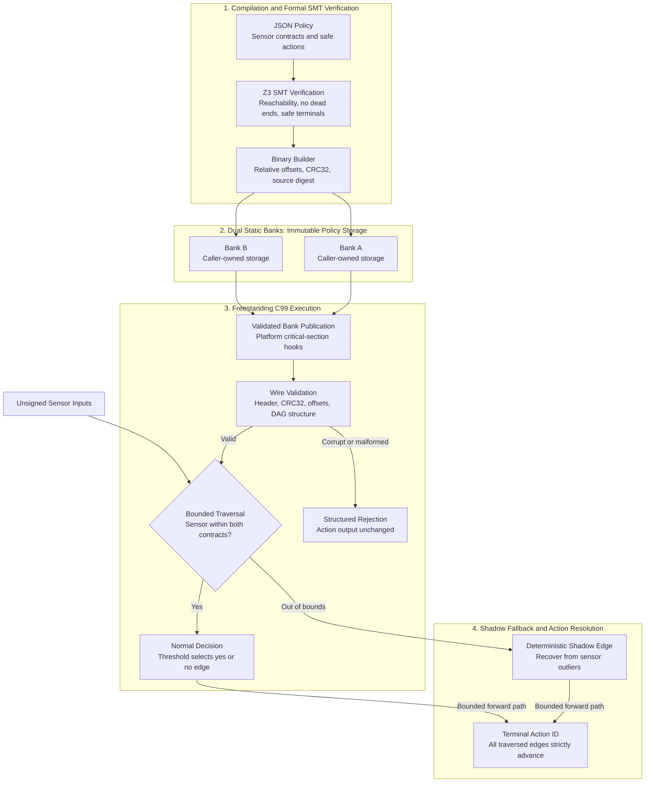

# ANIX Engine

[](#binary-abi-v1)
[](#formal-verification-scope)
[](#benchmark-and-verification)
[](#licensing)

**ANIX is a high-integrity execution engine for autonomous edge systems, turning verified decision policies into bounded, deterministic actions.** It combines compile-time SMT checks with a freestanding C99 runtime that reads immutable policy graphs directly from memory and routes sensor outliers through explicit shadow recovery paths.

**Asynchronous Non-blocking Invariant eXecution Engine**, formerly DSNE.
Copyright © 2026 Royalx LLC / Mahamodul Anin.

The latency badge reports a measured mean for the four-node host fixture; Z3
verification covers the policy properties described below. ANIX is
**source-available under PolyForm Noncommercial**, with separate commercial
licensing. Platform synchronization determines execution blocking behavior.

## Key Pillars: Why ANIX?

| Pillar | Engineering value | Evidence and boundary |
|---|---|---|
| **Sub-Microsecond Execution** | Compact decision graphs support fast policy evaluation with predictable traversal bounds. | **0.530 µs/call** observed host mean, including CRC and full blob validation. Target deadlines require target measurements. |
| **Mathematical Provability (SMT Z3)** | Prove terminal reachability, absence of dead ends, and preservation of a declared safe-action set across every uint32 sensor valuation. | Checks include shadow paths; the C implementation and physical system are outside the SMT proof. |
| **Zero-Dynamic Allocation** | Zero malloc/heap use in the runtime, no recursion or floating-point operations, and constant auxiliary memory. | The core executes directly from caller-owned bytes with bounded relative offsets; no graph copy or libc calls. |
| **Zero-Downtime Dual-Bank Hot-Swapping** | Publish a validated replacement policy without rebooting the device or copying its payload. | Platform critical-section hooks serialize publication and readers; execution may pause during the bounded critical section. |

## Architecture: From Verified Policy to Deterministic Action

Compilation establishes policy properties before deployment. The runtime checks
wire integrity and memory bounds on each call, then follows strictly advancing
edges to a terminal action.



Banks are supplied by the application; they may reside in static RAM, flash, or
another immutable readable region. The engine owns no allocator or storage pool.
Shadow recovery is an explicit policy path, while malformed binaries return an
error before policy execution.

## Real-World Applications

These are integration patterns for policies built and validated by the system
owner, rather than claims of certified deployments or ready-made control logic.

| Application | Policy examples | Integration requirement |
|---|---|---|
| **Autonomous Drones & Robotics** | Flight safety bounds, collision-avoidance action selection, and fallback behavior when a sensor exceeds its contract. | Define permitted actions and sensor ranges for the vehicle; validate complete sensing-to-actuation latency. |
| **EV Battery Management** | Temperature-bound thermal-runaway interlocks and protective action selection targeting microsecond execution budgets. | Validate sensor response, contactor timing, and worst-case latency on the actual BMS hardware; the host benchmark establishes no thermal protection guarantee. |
| **Aerospace & Defense** | Deterministic guidance fail-safes and bounded recovery policy selection. | Verify the guidance policy and platform integration against the application's assurance requirements; this release carries no aerospace certification. |

## Quickstart

With Python 3.11+, a C99 compiler and GNU Make:

```sh
python -m pip install -r compiler/requirements.txt
make build
make test
python -m compiler.builder examples/policy.json build/policy.bin
make clean
```

On Windows without Make, the same build/test/clean implementation is available as
`python tools/check.py build`, `python tools/check.py test`, and
`python tools/check.py clean`. It automatically finds a local Zig compiler installed
with `python -m pip install --target .tools ziglang z3-solver`.
For a compiler override: `python tools/check.py test --cc clang` or `make test CC=clang`.
Local tools and generated binaries are ignored by Git.

## Binary ABI v1

The wire header is **68 bytes**. Integers are unsigned little-endian words. The
magic is literal ASCII `ANIX` (bytes 41 4e 49 58): numeric 0x414E4958 expresses
those bytes in big-endian notation, and must not be stored as a little-endian word.

| Byte offset | Field |
|---:|---|
| 0 | Four-byte magic |
| 4 | Version, exactly 1 |
| 8 | Caller-defined policy ID |
| 12 | Entry offset relative to payload start |
| 16 | Exact payload length |
| 20 | IEEE CRC32 of payload, polynomial 0xedb88320 |
| 24 | 32-byte SHA256 verification/source digest |
| 56 | Node count, 1-4096 |
| 60 | Input count, 0-256 |
| 64 | Flags, exactly 1 (verified-builder format) |

Payload starts with one `(lower, upper)` pair per input (8 bytes each), followed by
32-byte nodes. All wire offsets are multiples of four, independent of the actual
address alignment of the caller's buffer; bytewise reads also support unaligned
buffers. Each node contains eight words:

| Kind | Words 0-7 |
|---|---|
| Action | 0, action ID, 0, 0, 0, 0, 0, 0 |
| Decision | 1, input index, threshold, lower, upper, yes offset, no offset, shadow offset |

A sensor within both global and decision bounds follows `yes` when its value is
at most threshold, otherwise `no`. A sensor outside either interval follows
`shadow`. All three edges must target a later node. This strict order gives a
structural termination proof and at most `node_count` traversal steps.

`anix_execute` validates the entire blob before execution. It leaves `action_out`
untouched on errors. Input count must exactly match the contract. Bounds are
checked for each accessed sensor; an unvisited sensor does not affect an action.
Status values distinguish argument, format, CRC, bounds, contract, and platform
failures. Policy ID and digest are application metadata.

## Formal verification scope

The compiler models sensors as integers constrained to the entire uint32 domain.
Z3 checks terminal reachability, absence of dead ends, and that every reachable
terminal belongs to `safe_actions`, including shadow paths. Branch predicates use
the same inclusive intervals and threshold rule as the C interpreter. Strictly
advancing edges establish acyclicity independently of the solver. Unreachable
nodes are permitted but must still be structurally valid.

The digest is SHA256 over `ANIX-verifier-v1` plus a NUL byte and canonical sorted,
compact JSON. It records the graph, contracts, policy and permitted actions.
It is a provenance identifier, **not a proof certificate or signature**. The C core
checks structural safety and payload CRC, not the SMT theorem or safe-action set.
CRC does not authenticate input, and header metadata is not covered by payload
CRC. An adversary can replace a blob and recompute its CRC. Deployments must
accept blobs from a trusted compiler and authenticate the complete artifact and
expected policy externally. This release does not formally verify the C source,
actuator physics, temporal properties, or arbitrary user-defined invariants.

## Dual-bank deployment and real-time contract

Initialize `anix_engine_t` with a validated bank and platform enter/leave hooks.
`anix_hot_swap_bank` validates the candidate, then publishes the alternate bank
under those hooks. Failed validation preserves the active bank. No payload is
copied. Readers hold the same critical section for their complete execution;
therefore a completed swap has no reader still executing the retired active bank.
Every registered buffer must stay immutable and alive while it can be selected.
Use `anix_engine_init`, never an uninitialized engine. Protect initialization and
any direct writes to engine state from concurrent access. Inputs and output must
not overlap immutable blobs or engine state.

Strict C99 has no standard atomic operations. Hooks must supply serialization,
compiler and hardware memory barriers, and a target-appropriate bounded critical
section. Bare-metal interrupt masking can be suitable for a single core; multicore
requires suitable cross-core serialization. No-op hooks are suitable only when
calls cannot overlap. Calling execution recursively or reentering from an ISR
while a non-reentrant lock is held is unsupported. Hook implementations determine
blocking behavior; this portable implementation does not claim lock-free reads.

"Loop-free" means no graph cycles. CRC and validation are bounded loops, and
traversal is iterative and bounded; literal loop-free C would require unrolling.
Worst-case execution cost is O(payload bytes + nodes), constant auxiliary memory,
and no graph copy. Validation on every call deliberately makes corrupt blobs
rejectable at the public execute entry point. Actual real-time deadlines require
measurements on the target, including flash/cache and critical-section costs.

## Benchmark and verification

Measured on this Windows x86-64 host with Zig 0.16.0, strict C99, `-O2`.
`tests/benchmark.c` uses host CPU clock across 100,000 calls, including CRC and
full structural validation. Clock quantization and host scheduling affect results.

| Fixture | Nodes | Payload | Observed mean |
|---|---:|---:|---:|
| One decision, three terminals | 4 | 136 bytes | 0.530 µs/call |
| MCU worst-case latency | N/A | N/A | Requires target measurement |

`make test` runs interoperability fixtures generated by the verified compiler,
normal decisions, uint32-max and contract outliers, all truncation lengths,
corrupt CRC/magic, CRC-correct cyclic edges, untouched outputs on failure,
bank publication and failed-swap preservation. Python tests check exact wire ABI,
deterministic compilation, unsafe reachable actions and invalid graph contracts.
The runtime compiles with `-std=c99 -ffreestanding -Wall -Wextra -Werror -pedantic`.
The hosted tests and benchmark use libc; the runtime does not.

## Licensing

Source-available / dual licensing. The unmodified
[PolyForm Noncommercial 1.0.0 license](https://github.com/polyformproject/polyform-licenses/blob/1.0.0/PolyForm-Noncommercial-1.0.0.md)
is in `LICENSE`. Academic and personal noncommercial use is free under its terms.
Commercial use strictly requires separate explicit written enterprise authorization
from Royalx LLC / Mahamodul Anin. This repository grants no commercial rights.
